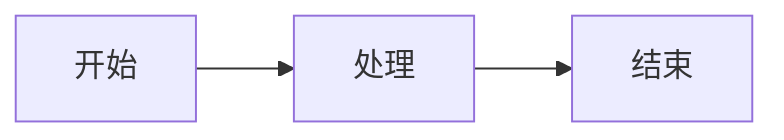
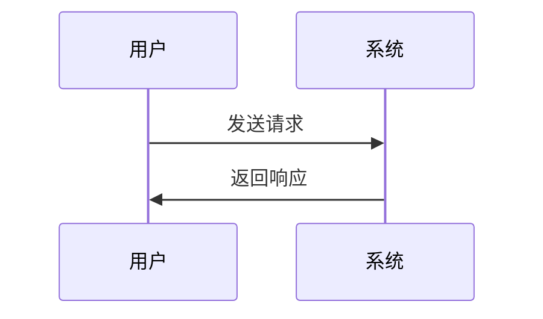

# Mermaid 图表渲染方案

> 问题：AI生成的Mermaid代码在对话中显示为代码而非图形

---

## 一、问题分析

**当前状态**：
- 对话窗口使用 `react-markdown` + `remark-gfm` 渲染AI回复
- Mermaid代码被当作普通代码块显示，没有渲染成图形

**用户需求**：
- AI生成的Mermaid图表（如流程图、时序图）能够直接渲染成图形
- 保持代码块的可复制性

---

## 二、解决方案

### 方案A：集成mermaid库（推荐）

**原理**：
- 使用 `mermaid` 库在浏览器端渲染Mermaid图表
- 在 `react-markdown` 中添加自定义代码块渲染器
- 检测 `mermaid` 语言标记的代码块，调用mermaid渲染

**优势**：
- 官方支持，功能完整
- 渲染效果好
- 支持所有Mermaid图表类型

**劣势**：
- 增加包体积（mermaid约2MB）
- 首次渲染可能较慢

### 方案B：服务端渲染

**原理**：
- 在Electron主进程中使用mermaid渲染
- 将渲染结果（SVG）返回给前端

**优势**：
- 前端不需要加载mermaid库
- 渲染性能更好

**劣势**：
- 需要修改IPC通信
- 实现复杂度高

### 方案C：外部服务

**原理**：
- 使用第三方服务（如mermaid.ink）渲染
- 通过图片URL嵌入

**优势**：
- 实现简单
- 不增加包体积

**劣势**：
- 依赖外部服务
- 需要网络连接
- 隐私问题

---

## 三、推荐方案：方案A

### 3.1 安装依赖

```bash
npm install mermaid
```

### 3.2 创建Mermaid渲染组件

```typescript
// src/components/MermaidChart/index.tsx
import { useEffect, useRef } from 'react'
import mermaid from 'mermaid'

interface MermaidChartProps {
  code: string
  id?: string
}

export default function MermaidChart({ code, id }: MermaidChartProps) {
  const ref = useRef<HTMLDivElement>(null)

  useEffect(() => {
    if (ref.current) {
      mermaid.initialize({ startOnLoad: false, theme: 'default' })
      mermaid.render(`mermaid-${id || Date.now()}`, code).then(({ svg }) => {
        if (ref.current) {
          ref.current.innerHTML = svg
        }
      })
    }
  }, [code, id])

  return <div ref={ref} className="mermaid-chart" />
}
```

### 3.3 修改MarkdownPreview组件

```typescript
// src/components/MarkdownPreview/index.tsx
import ReactMarkdown from 'react-markdown'
import remarkGfm from 'remark-gfm'
import rehypeHighlight from 'rehype-highlight'
import rehypeRaw from 'rehype-raw'
import rehypeSanitize from 'rehype-sanitize'
import MermaidChart from '../MermaidChart'
import '../../styles/markdown-preview.css'

interface MarkdownPreviewProps {
  content: string
  maxHeight?: number
}

export default function MarkdownPreview({ content, maxHeight = 600 }: MarkdownPreviewProps) {
  return (
    <div className="markdown-body" style={{ maxHeight, overflowY: 'auto', padding: '16px 0' }}>
      <ReactMarkdown
        remarkPlugins={[remarkGfm]}
        rehypePlugins={[rehypeHighlight, rehypeRaw, rehypeSanitize]}
        components={{
          code({ node, className, children, ...props }) {
            const match = /language-(\w+)/.exec(className || '')
            if (match && match[1] === 'mermaid') {
              return <MermaidChart code={String(children).replace(/\n$/, '')} />
            }
            return <code className={className} {...props}>{children}</code>
          }
        }}
      >
        {content}
      </ReactMarkdown>
    </div>
  )
}
```

### 3.4 修改ChatWindow组件

同样的修改需要应用到ChatWindow.tsx中的ReactMarkdown组件。

### 3.5 添加CSS样式

```css
/* src/styles/mermaid-chart.css */
.mermaid-chart {
  background: var(--bg-surface);
  border: 1px solid var(--border-default);
  border-radius: var(--radius-md);
  padding: 16px;
  margin: 8px 0;
  overflow-x: auto;
}

.mermaid-chart svg {
  max-width: 100%;
  height: auto;
}
```

---

## 四、实施步骤

1. 安装mermaid依赖
2. 创建MermaidChart组件
3. 修改MarkdownPreview组件
4. 修改ChatWindow组件
5. 添加CSS样式
6. 测试验证

---

## 五、测试用例

```markdown
## 测试Mermaid图表

### 流程图


### 时序图

```

---

## 六、相关文件

- `src/components/MarkdownPreview/index.tsx` - 需要修改
- `src/components/Chat/ChatWindow.tsx` - 需要修改
- `src/styles/markdown-preview.css` - 需要添加样式
- `package.json` - 需要添加mermaid依赖
