# PMAer 用户操作手册

> 版本：v0.2.0 | 更新日期：2026-06-30

---

## 一、简介

PMAer（Project Management Assistant）是一款AI驱动的项目管理桌面应用。核心价值：

- **告别手动整理**：上传项目文件后，AI自动按10个阶段归档，文件井井有条
- **智能信息提取**：自动识别合同金额、客户信息、需求清单、关键问题，重要信息一目了然
- **项目全景掌控**：卡片系统按阶段展示核心数据，售前看合同利润，进行中看需求问题，关闭时看商机总结
- **一键项目转交**：项目打包分享给同事，导入后数据完整保留，无需重复分析

---

## 二、安装与启动

1. 双击 `PMAer-0.2.0-Setup.exe`，按提示选择安装目录
2. 安装完成后桌面生成快捷方式，双击启动
3. 首次启动弹出引导窗口：
   - **Step 1**：选择项目文件存储位置（默认安装目录下 `projects` 文件夹，可自定义）
   - **Step 2**：选择AI配置方式
     - **使用内置Key**：开发者的测试接口，可试用体验（2026年7月底关闭，届时请切换自己的Key）
     - **使用自己的Key**：填写API Key，支持11家AI厂商

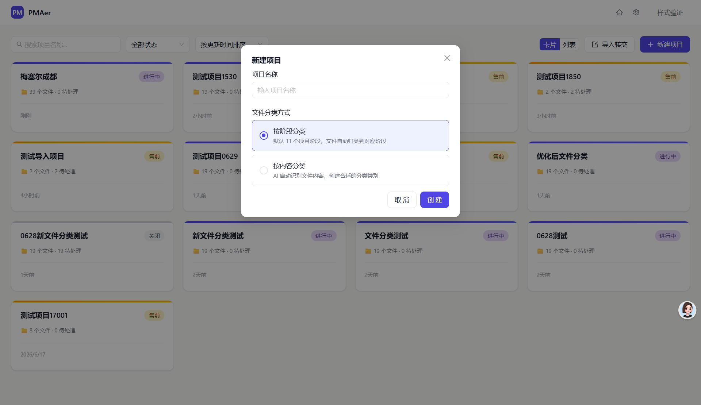
*图1：项目列表页，点击右上角「+ 新建项目」创建新项目*

---

## 三、主界面

应用分为4个主要页面：

| 页面 | 入口 | 功能 |
|------|------|------|
| 项目列表 | 启动后默认页 | 所有项目概览，支持创建、搜索、删除、导入 |
| 项目详情 | 点击项目卡片进入 | 文件管理、AI分类、卡片信息面板 |
| AI对话 | 项目详情页右上角「对话」按钮 | 基于项目文件的专属AI助手 |
| 设置 | 项目详情页右上角⚙️ | AI模型、文件提取、Prompt等配置 |

---

## 四、项目管理

### 4.1 创建项目

1. 在项目列表页点击右上角「+ 新建项目」
2. 输入项目名称
3. 选择分类方式：
   - **按阶段分类**（推荐）：文件按10个阶段（售前→关闭）自动归档，适合项目全生命周期管理
   - **按内容分类**：AI自动识别文件内容类型
4. 点击「创建」，系统自动创建项目文件夹结构


*图2：新建项目弹窗 — 输入名称，选择分类方式后点击「创建」*

### 4.2 项目阶段

每个项目有3个**项目阶段**（不可自定义）：

```
售前 → 进行中 → 关闭
```

阶段推进方式：
- **手动推进**：在项目详情页点击「推进到下一阶段」按钮
- **自动推进**：上传验收报告/项目总结/项目归档/复盘总结类文件时，AI自动弹窗确认推进

---

## 五、文件管理

### 5.1 上传文件

在项目详情页有3种上传方式：
1. **拖拽上传**：将文件直接拖到上传区域
2. **点击上传**：点击上传区域选择文件
3. **侧边栏上传**：点击左侧底部「上传文件」按钮

支持格式：PDF、Word（.doc/.docx）、Excel、PPT、TXT、Markdown、图片
单文件限制：50MB

### 5.2 AI自动分类

文件上传后，AI自动完成3项判断：

| 判断 | 说明 | 示例 |
|------|------|------|
| 文件分类阶段 | 属于10个阶段中的哪个 | 需求、测试、上线 |
| 子分类 | 属于该阶段下的哪个用途 | 需求文档、会议纪要 |
| 项目阶段 | 属于售前/进行中/关闭 | 进行中 |

分类完成后，文件自动移动到对应文件夹。

> **注意**：AI分类并非100%准确，尤其对于跨阶段文件（如验收文件出现在售前文件夹中）。建议分类完成后人工审查一遍，发现分类不准确的文件可手动调整（点击分类下拉菜单选择正确分类）。

### 5.3 手动分类

- **单个文件**：在文件列表中点击分类下拉菜单，选择新分类
- **批量分类**：勾选多个文件，点击顶部「批量分类」按钮
- **一键分类**：点击「一键分类」按钮，对所有未分类文件批量触发AI分类

### 5.4 10个文件分类阶段

| 阶段 | 子分类 |
|------|--------|
| 售前 | 销售方案、报价单、合同原件、客户沟通、成本评估、POC材料 |
| 启动 | 项目章程、团队组建、启动会议 |
| 需求 | 需求文档、会议纪要、需求变更、客户材料、项目计划 |
| 方案 | 开发规格说明书、蓝图、方案汇报材料、会议纪要 |
| 构建 | 开发文档、接口文档、配置文档 |
| 测试 | 测试用例、测试报告、测试数据、会议纪要 |
| 上线 | 上线切换方案、部署文档、操作手册、签字材料、初始化材料、问题清单、会议纪要 |
| 验收 | 验收材料待签、验收签字件已签、验收报告、项目总结 |
| 转客户成功 | 交接文档、培训资料、FAQ |
| 关闭 | 项目归档、复盘总结 |

### 5.5 其他操作

- **打开文件夹**：点击「打开文件夹」按钮，直接在资源管理器中查看文件
- **删除文件**：在文件列表中勾选文件，点击「删除」按钮
- **刷新列表**：点击「刷新」按钮重新加载文件

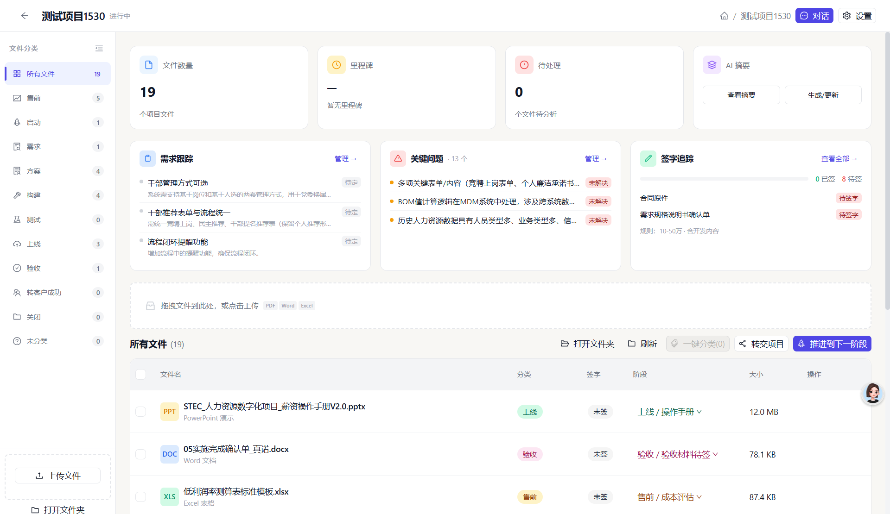
*图5：项目详情页（进行中阶段） — 左侧阶段导航+右侧卡片面板+下方文件列表*

---

## ⭐ 六、项目卡片信息面板

项目详情页上方显示统计行和特色卡片，帮助你快速掌握项目全貌。不同阶段显示不同的卡片组合。

> **说明**：卡片数据由AI自动提取，准确率约85-90%。部分字段可能不完整或有偏差，建议结合原始文件核实重要数据。卡片内容暂不支持手动编辑，后续版本将逐步开放编辑功能。

### 6.1 统计行

统计行固定显示4张小卡片：

| 卡片 | 显示内容 | 点击操作 |
|------|---------|---------|
| 📁 文件数量 | 项目文件总数 | 无 |
| ⏱️ 里程碑 | 下一步里程碑名称和日期 | 弹窗查看完整时间轴 |
| ⏳ 待处理 | 未被AI分析的文件数 | 无 |
| 🤖 AI摘要 | 查看/生成项目摘要 | 弹窗查看或生成摘要 |

### 6.2 特色卡片（按阶段切换）

**售前阶段** — 重点看合同和利润：

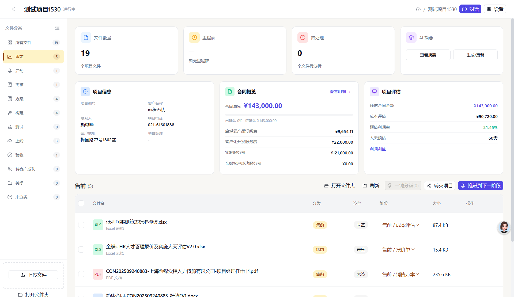
*图6：售前阶段卡片 — 项目信息+合同概览+项目评估*

| 卡片 | 数据来源 | 业务价值 |
|------|---------|---------|
| 📋 项目信息 | AI从合同/沟通文件提取 | 客户名称、联系人、电话、地址，快速了解客户 |
| 📄 合同概览 | AI从合同文件提取 | 合同总额、分项金额、付款里程碑，掌握收款节奏 |
| 🖥️ 项目评估 | 利润测算工具 | 合同金额、成本、利润率、人天，判断项目是否值得做 |

**进行中阶段** — 重点看执行和风险：

| 卡片 | 数据来源 | 业务价值 |
|------|---------|---------|
| 📝 需求跟踪 | AI从需求文档/会议纪要提取 | 需求清单和状态，确保不遗漏客户需求 |
| ⚠️ 关键问题 | AI从各类文档识别 | 风险和阻塞项，提前预警避免项目延期 |
| ✏️ 签字追踪 | AI从合同/验收文件识别 | 签字文件状态和进度，把控验收流程 |

**转客户成功阶段**：

| 卡片 | 数据来源 | 业务价值 |
|------|---------|---------|
| ✏️ 签字追踪 | 同上 | 继续跟进签字进度 |
| 🚀 拓展商机 | AI从项目文档识别 | 二期/三期规划，发现新的商业机会 |
| 📦 交付物清单 | AI从方案/验收文件识别 | 交付物状态，确保按时交付 |

**关闭阶段** — 重点看收尾和沉淀：

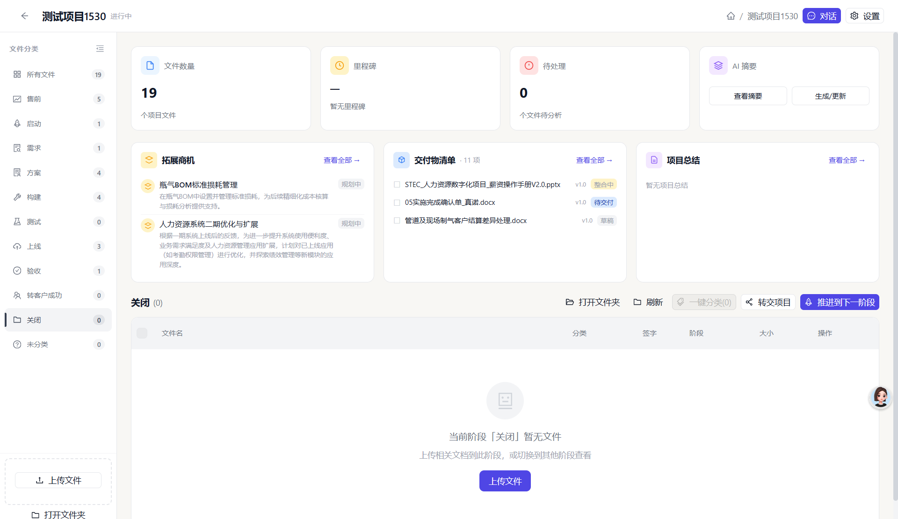
*图7：关闭阶段卡片 — 拓展商机+交付物清单+项目总结*

| 卡片 | 数据来源 | 业务价值 |
|------|---------|---------|
| 🚀 拓展商机 | AI识别 | 项目衍生的商业机会 |
| 📦 交付物清单 | AI识别 | 11项交付物状态，版本追踪 |
| 📊 项目总结 | AI分析生成 | 项目成果和复盘，经验沉淀 |

---

## ⭐ 七、利润测算工具

点击「项目评估」卡片中的「利润测算」链接，打开利润测算弹窗。

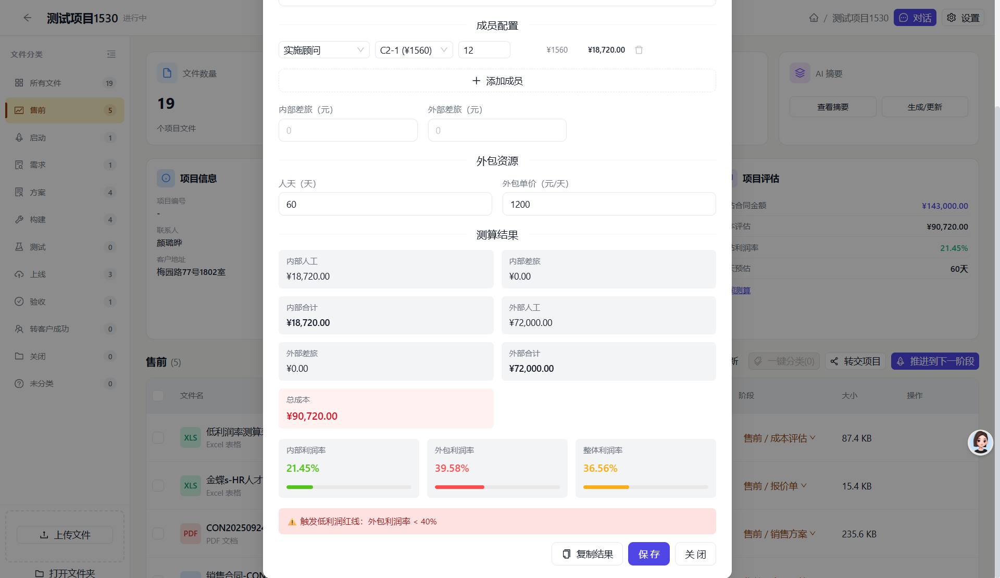
*图8：利润测算 — 输入成员和外包信息，实时计算利润率*

### 7.1 使用步骤

1. **输入合同总额**（如有合同文件，系统自动填入）
2. **添加团队成员**：点击「+ 添加成员」，选择角色和职级，输入人天
   - 系统根据角色和职级自动计算单价（如实施顾问C2-1 = ¥1,560/天）
3. **填写外包信息**：外包人天、外包单价（默认¥1,200/天）、外部差旅
4. **填写内部差旅**
5. 系统**实时计算**，无需点击按钮

### 7.2 查看结果

- **成本分配明细**：内部/外包人天成本、差旅、总成本、合同分配
- **利润率三栏**：内部/外包/整体利润率，带进度条
- **红线警告**：内部利润率<0%（红色）或外包利润率<40%（黄色）时自动提醒
- **利润额**：合同总额 - 总成本

### 7.3 保存和复制

- 点击「保存」按钮，测算结果自动保存到项目，外部卡片立即更新
- 点击「复制结果」按钮，一键复制测算文本到剪贴板
- 下次打开弹窗，自动恢复上次的测算数据

---

## 八、AI智能分析

### 8.1 AI自动分类

文件上传后自动触发，AI完成3项判断（分类阶段+子分类+项目阶段）。分类结果实时显示在文件列表的「分类」列。


*图9：文件列表 — 每个文件显示分类结果（如售前/成本评估），支持点击修改*

### 8.2 AI摘要生成

在项目详情页统计行点击「生成/更新」按钮，AI基于所有文件生成结构化摘要。

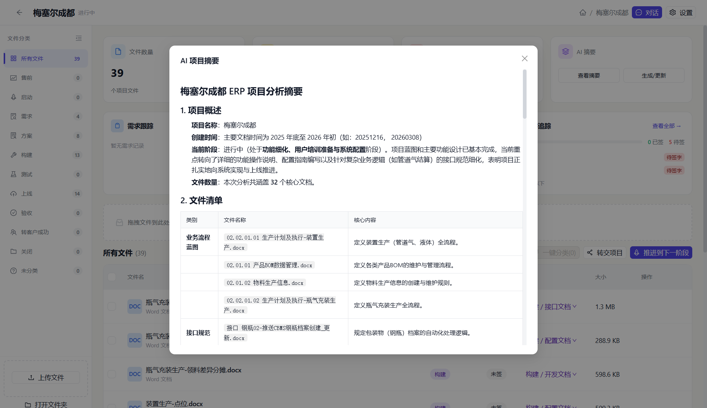
*图10：AI项目摘要 — Markdown渲染，包含项目概述、文件清单、关键发现、建议*

摘要内容包含：
- 项目概述（名称、阶段、文件数量）
- 文件清单（按类别分组的表格）
- 当前进展
- 关键问题
- 建议和风险

生成后点击「查看摘要」按钮，以Markdown格式渲染展示。

> **说明**：AI摘要基于文件内容自动生成，可能遗漏部分信息或存在理解偏差。建议将摘要作为参考，重要决策请以原始文件为准。摘要内容支持重新生成。

### 8.3 AI对话

在项目详情页点击右上角「对话」按钮进入AI对话窗口。

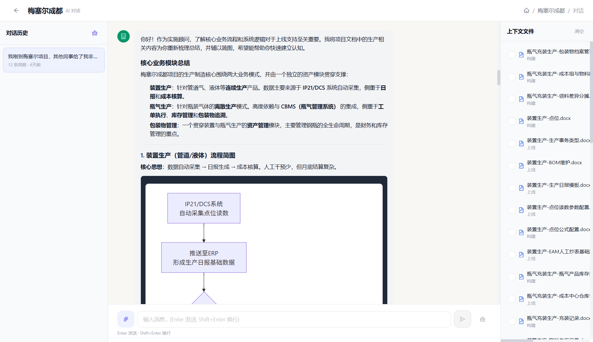
*图11：AI对话 — 右侧文件面板选择上下文，AI基于项目文件回答问题*

**对话特点**：
- **项目绑定**：AI能读取项目中的所有文件，回答针对性强
- **多会话管理**：支持创建多个对话会话
- **文件上下文**：点击右侧📎按钮，勾选文件作为AI上下文
- **Markdown渲染**：AI回复支持表格、流程图（Mermaid）、代码块等

---

## 九、卡片详情弹窗

点击卡片上的「管理 →」或「查看全部 →」按钮，打开详情弹窗。

### 9.1 需求跟踪

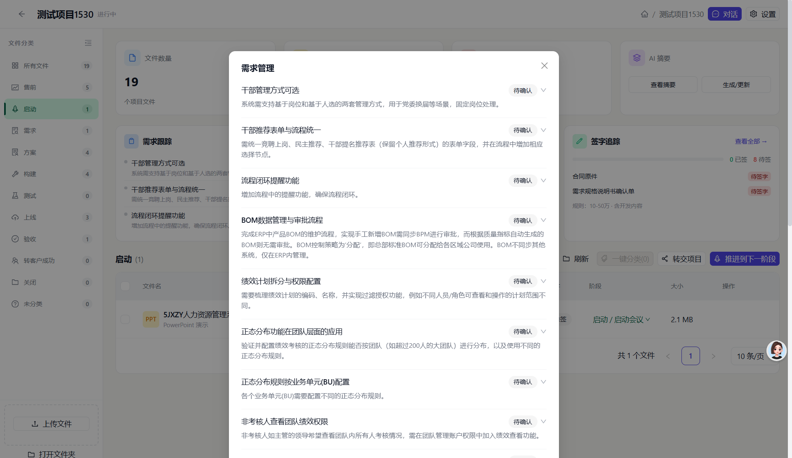
*图12：需求管理弹窗 — 每条需求可展开查看详情，状态标签区分待确认/进行中/已完成*

- 显示所有AI提取的需求清单
- 每条需求：名称、详情、状态标签
- 点击展开可查看方案和来源

### 9.2 关键问题

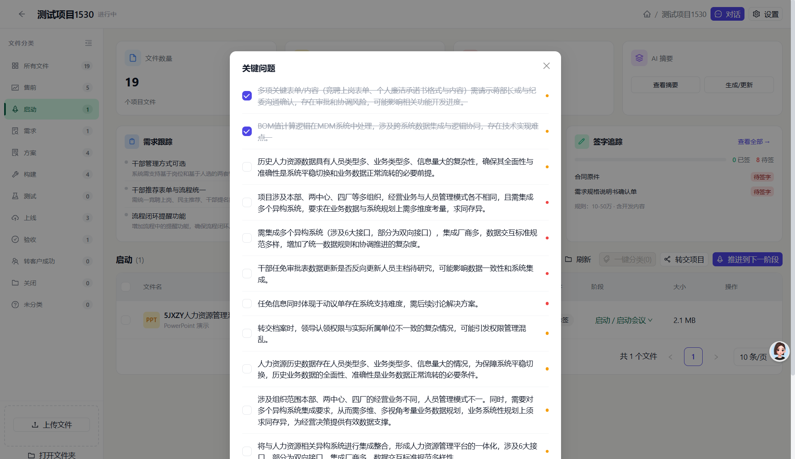
*图13：关键问题弹窗 — Checkbox勾选标记已解决，优先级圆点区分高/中/低*

- AI识别的项目风险和阻塞项
- 支持Checkbox勾选标记已解决（文字变灰色+删除线）
- 优先级圆点：🔴高 🟡中 🔵低

### 9.3 签字追踪

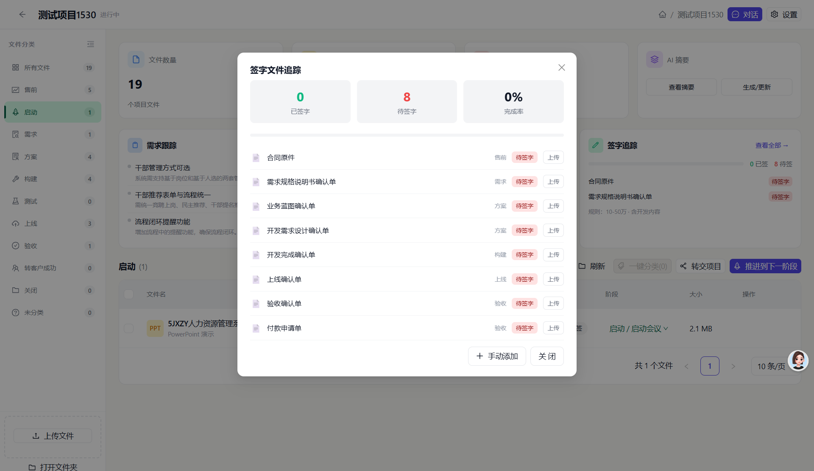
*图14：签字追踪弹窗 — 统计网格+文件列表，每项显示阶段和签字状态*

- 统计：已签字/待签字/完成率
- 文件列表：每个签字文件的阶段和状态
- 支持上传已签字的文件

### 9.4 拓展商机

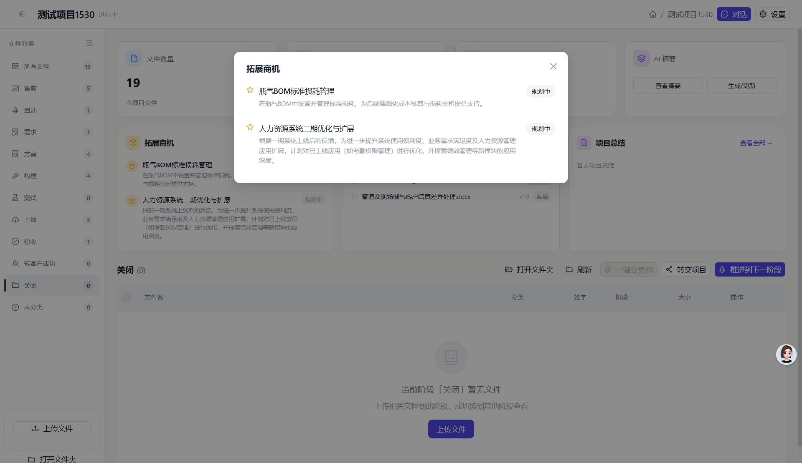
*图15：拓展商机弹窗 — AI识别的二期/三期规划和商业机会*

- AI从项目文档中识别的衍生商机
- 每条：名称、描述、状态标签（规划中/已确认）

### 9.5 交付物清单

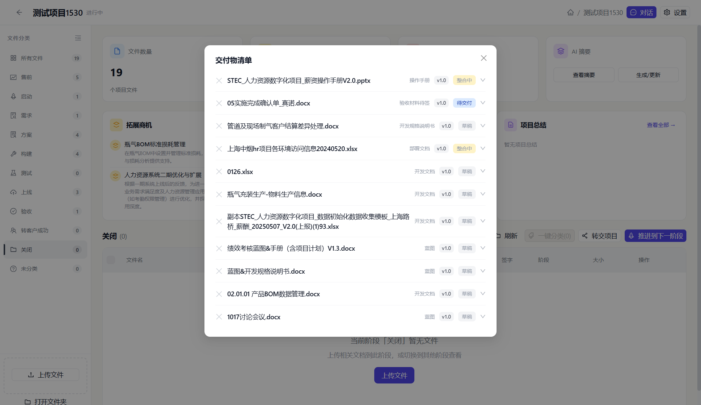
*图16：交付物清单弹窗 — 11项交付物，状态标签区分整合中/待交付/草稿*

- AI从方案/验收文件自动识别交付物
- 状态：整合中、待交付、草稿、已交付
- 支持版本历史展开

### 9.6 项目总结

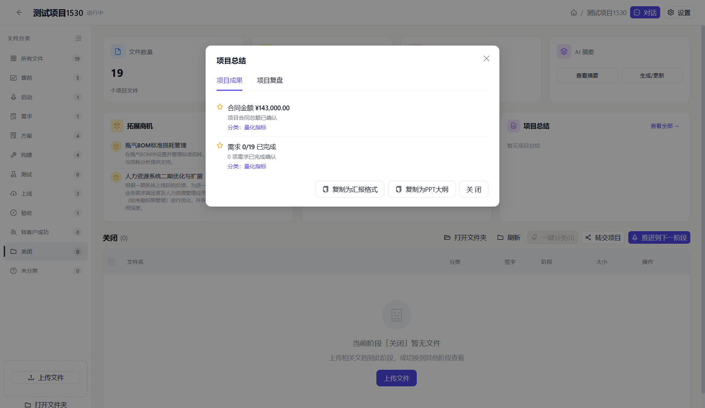
*图17：项目总结弹窗 — 双Tab（项目成果/项目复盘），一键复制为汇报格式或PPT大纲*

- **项目成果Tab**：合同金额、需求完成度等量化指标
- **项目复盘Tab**：做得好/待改进/经验教训
- **复制按钮**：一键复制为汇报格式或PPT大纲，直接用于汇报

---

## 十、项目转交

> **业务场景**：项目转交是团队协作中的高频需求。当你需要将项目交接给同事、跨团队共享分析成果、或从其他同事处接手项目时，转交功能可以完整保留所有文件分类、AI分析结果和项目元数据，避免重复劳动。

### 10.1 导出转交包

在项目详情页点击「转交项目」按钮：

**场景1：整体转交 — 项目交接**
- 选择「整体转交」
- 适用场景：项目负责人变更、团队重组、离职交接
- 打包所有文件和分析数据，同事导入后即可接手

**场景2：协作转交 — 选择性共享**
- 选择「协作转交」，输入描述（如"新同事需要了解业务模块，不要给合同金额等敏感信息"）
- AI根据描述智能推荐相关文件，自动勾选
- 适用场景：跨部门协作、实习生培训、部分文件共享

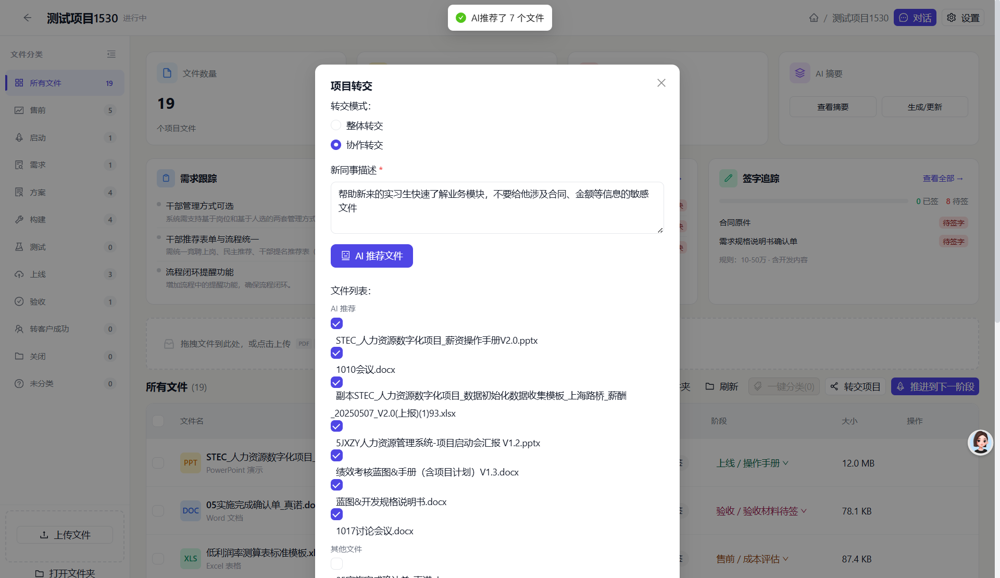
*图18：协作转交 — 输入描述，AI推荐7个相关文件，自动勾选*

填写转交说明（可选）→ 点击「导出」→ 选择保存位置 → 生成`.pmaer.zip`文件

### 10.2 导入转交包

从同事处获得`.pmaer.zip`文件后：

1. 在项目列表页点击右上角「导入转交」
2. 选择`.pmaer.zip`文件
3. 预览项目信息（名称、文件数量、阶段）
4. 可修改导入后的项目名称
5. 点击「确认导入」

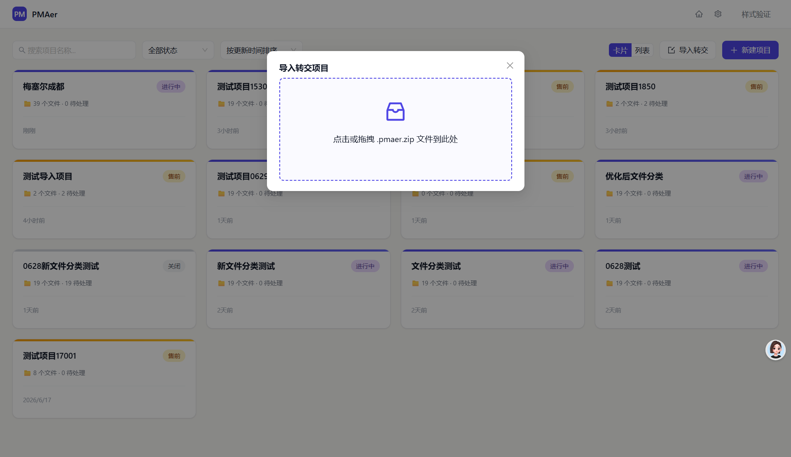
*图19：导入弹窗 — 点击或拖拽.pmaer.zip文件到上传区域*

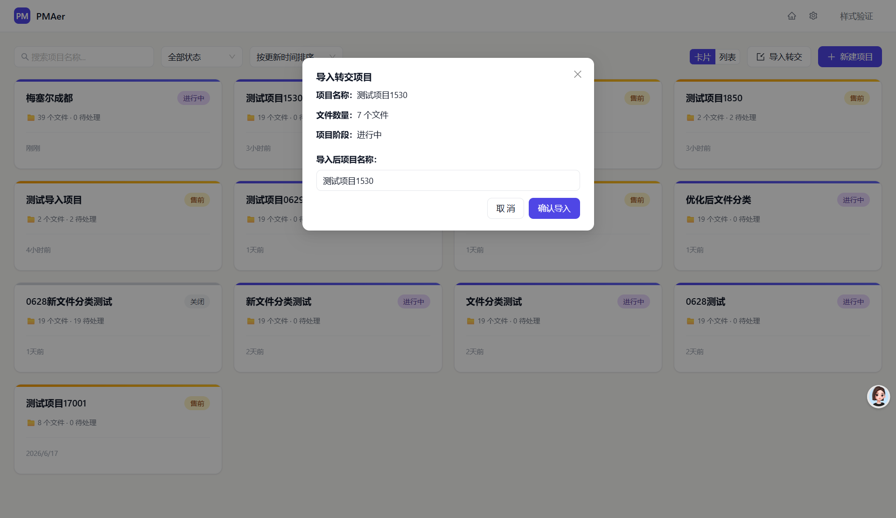
*图20：导入预览 — 显示项目名称、文件数量、阶段，确认后点击「确认导入」*

**导入后保留的数据**：文件分类、AI摘要、项目阶段、签字状态、合同信息等所有分析数据，无需重新分析。

> **提示**：导入后建议检查一遍文件分类是否准确，AI分类并非100%准确，必要时可手动调整。

---

## 十一、侧边栏文件分类

项目详情页左侧显示10个分类阶段，每个阶段旁显示文件数量。

| 功能 | 操作 |
|------|------|
| 查看某阶段文件 | 点击对应阶段名称 |
| 查看所有文件 | 点击「所有文件」 |
| 查看未分类文件 | 点击「未分类」 |
| 折叠/展开侧边栏 | 点击顶部折叠按钮 |

不同阶段的右侧卡片组合不同（详见第六章）。

---

## 十二、设置

点击项目详情页右上角⚙️进入设置页面。

### 12.1 AI模型

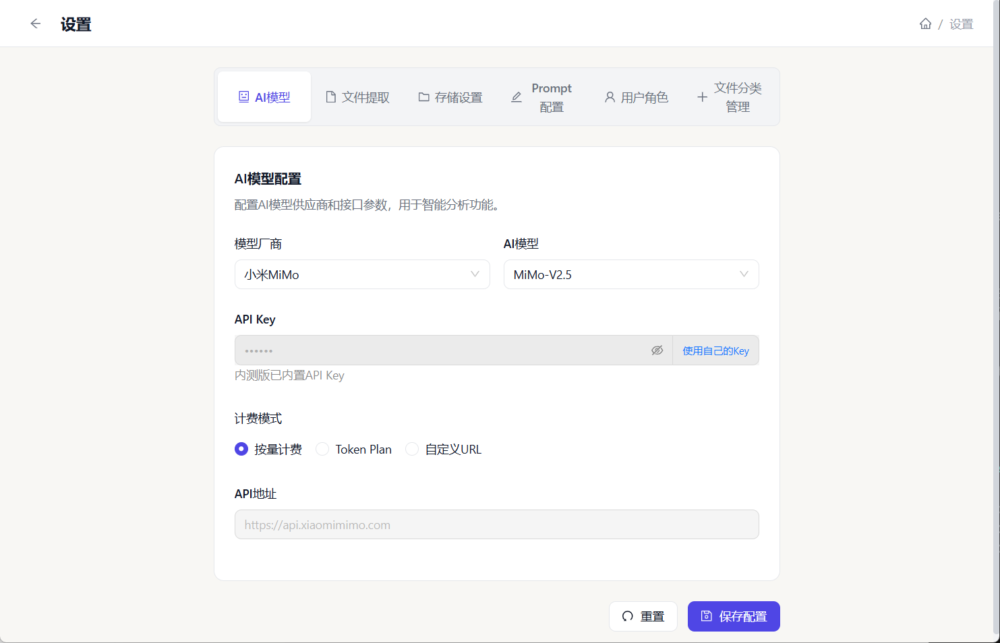
*图19：AI模型配置 — 选择厂商和模型，填写API Key*

| 配置项 | 说明 |
|--------|------|
| 模型厂商 | 选择AI服务提供商（小米MiMo、智谱、阿里千问等11家） |
| AI模型 | 选择具体模型 |
| API Key | 填写API密钥。测试阶段可使用内置Key试用（7月底关闭），届时需填写自己的Key |
| 计费模式 | 按量计费 / Token Plan / 自定义URL |
| API地址 | 自定义API接口地址（高级） |

### 12.2 文件提取

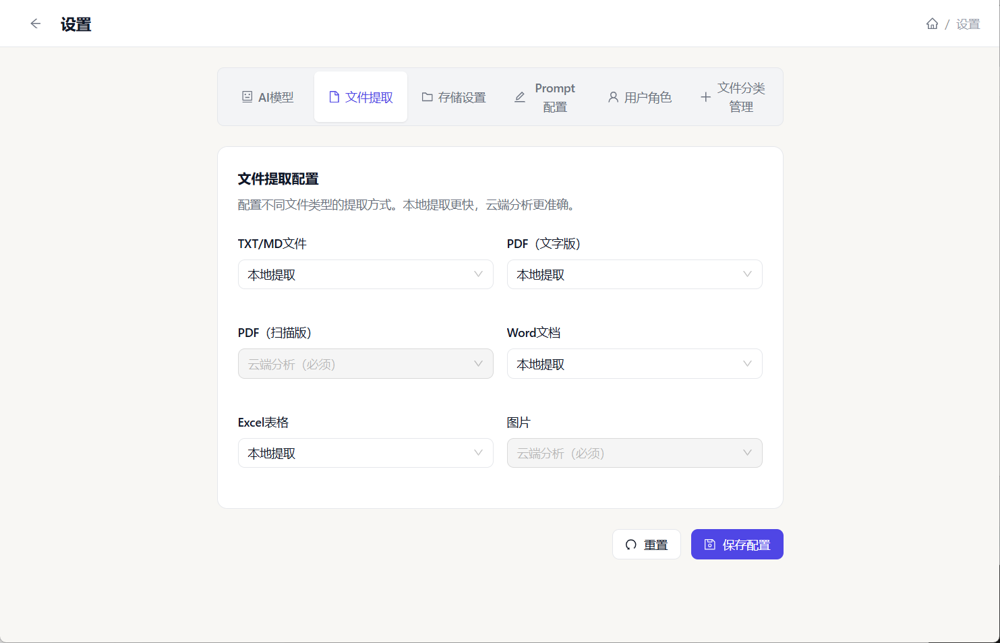
*图20：文件提取配置 — 本地提取更快，云端分析更准确*

配置各格式文件的提取方式：
- TXT/MD文件：本地提取
- PDF文字版：本地提取
- PDF扫描版：云端分析（必须）
- Word文档：本地提取
- Excel表格：本地提取
- 图片：云端分析（必须）

### 12.3 存储设置

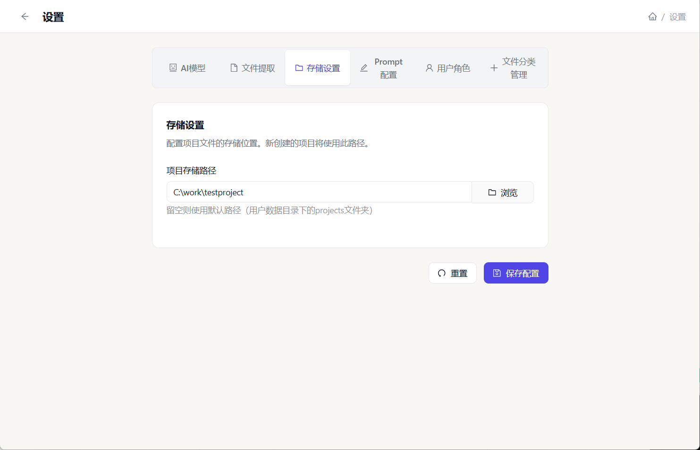
*图21：存储设置 — 配置项目文件存储位置*

配置项目文件的存储位置，新创建的项目将使用此路径。

### 12.4 Prompt配置

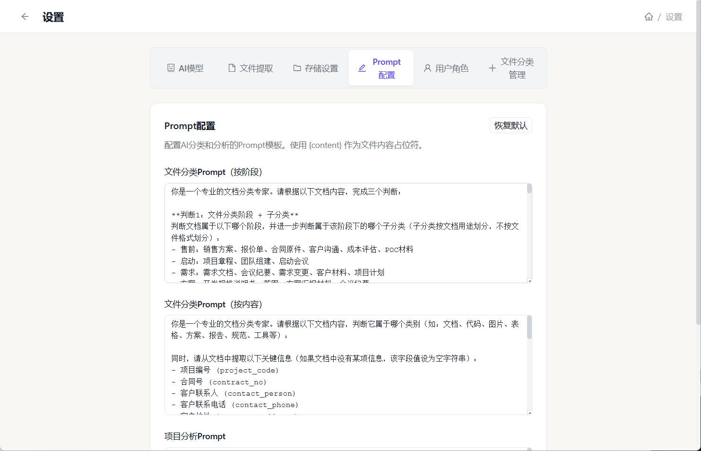
*图22：Prompt配置 — 可自定义AI分类和分析的Prompt模板*

可自定义AI使用的Prompt模板：
- 文件分类Prompt（按阶段）
- 文件分类Prompt（按内容）
- 项目分析Prompt

点击「恢复默认」可还原为内置Prompt。

### 12.5 用户角色

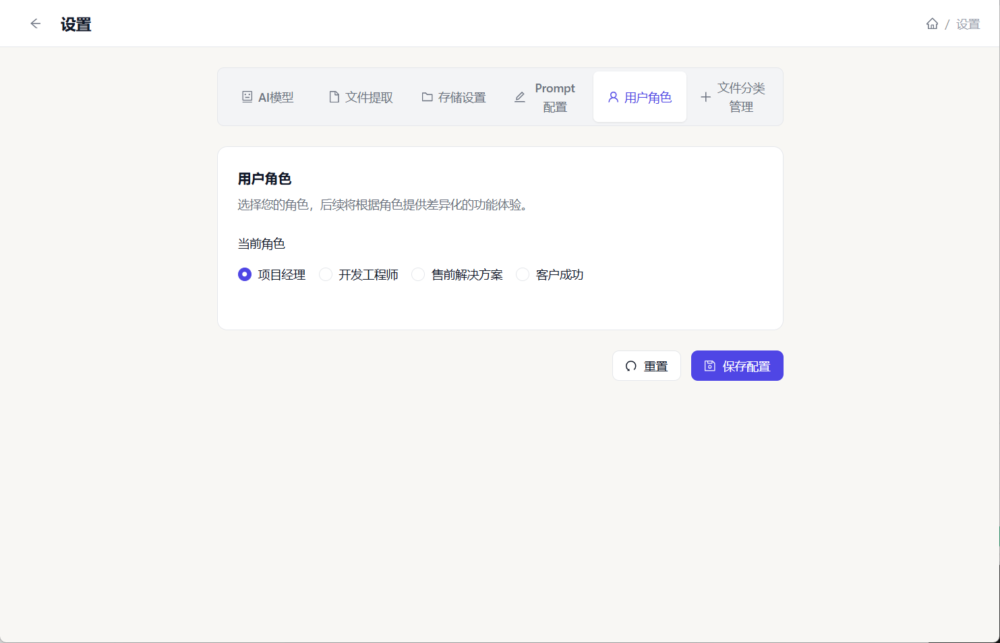
*图23：用户角色 — 选择角色，AI根据角色调整回复风格*

可选角色：项目经理、开发工程师、售前解决方案、客户成功

> **说明**：当前版本角色选择暂未触发差异化功能，仅记录用户偏好。后续版本将根据角色调整AI回复风格、卡片展示重点和功能入口。

### 12.6 文件分类管理

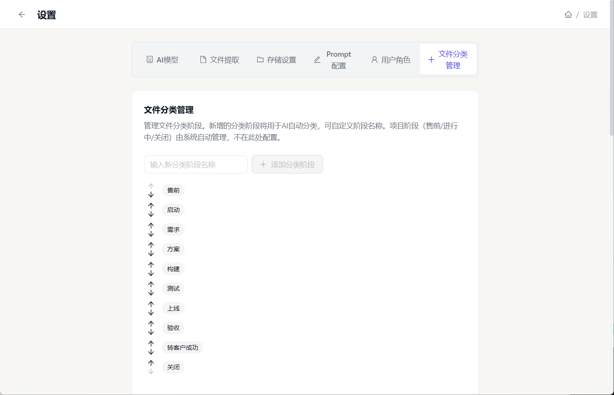
*图24：文件分类管理 — 拖拽调整阶段顺序，新增/删除分类*

自定义10个分类阶段的顺序和子分类。

---

## 十三、支持的AI厂商

| 厂商 | 说明 |
|------|------|
| 小米MiMo | 测试阶段默认内置（7月底关闭） |
| 智谱 | GLM系列 |
| 阿里千问 | Qwen系列 |
| 腾讯混元 | hunyuan系列 |
| 百度文心 | ERNIE系列 |
| DeepSeek | V4系列 |
| 月之暗面Kimi | Kimi K2系列 |
| 讯飞星火 | spark系列 |
| 百川智能 | Baichuan系列 |
| MiniMax | M3系列 |
| 零一万物 | Yi系列 |

---

## 十四、常见问题

### Q：安装后提示"AI服务未配置"怎么办？

打开设置页 → AI模型，选择厂商并填写API Key。测试阶段可选择「使用内置Key」试用（7月底关闭）。

### Q：文件上传后没有自动分类？

检查AI是否已配置。未配置AI时，系统会根据文件名推断分类（准确度较低）。

### Q：如何修改已分类的文件？

在文件列表中找到该文件，点击分类下拉菜单，选择新分类。

### Q：项目阶段可以倒退吗？

不支持。阶段只能从售前→进行中→关闭单向推进，防止误操作。

### Q：支持哪些文件格式？

PDF、Word（.doc/.docx）、Excel、PPT、TXT、Markdown、JPG/PNG图片。单文件最大50MB。

### Q：利润测算的数据会丢失吗？

不会。测算结果自动保存到项目中，下次打开弹窗会恢复上次的数据。

### Q：转交导入后需要重新分析文件吗？

不需要。导入会保留原有的文件分类、AI摘要、阶段信息等所有分析数据。

### Q：利润率红线是什么意思？

- 内部利润率 < 0%：自有交付亏损，显示红色警告
- 外包利润率 < 40%：触发低利润审批，显示黄色警告
- 低于红线时需要重新评估项目报价或资源配置
